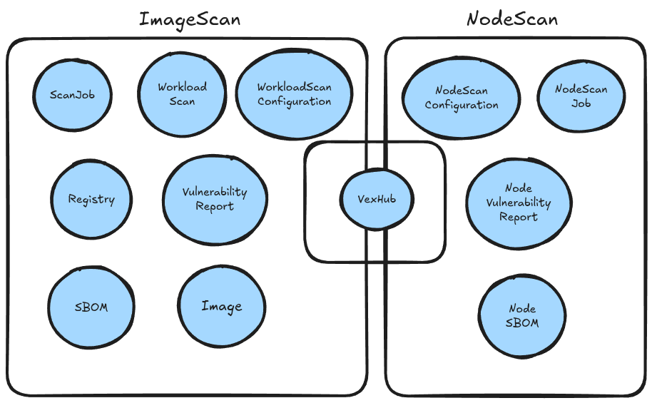
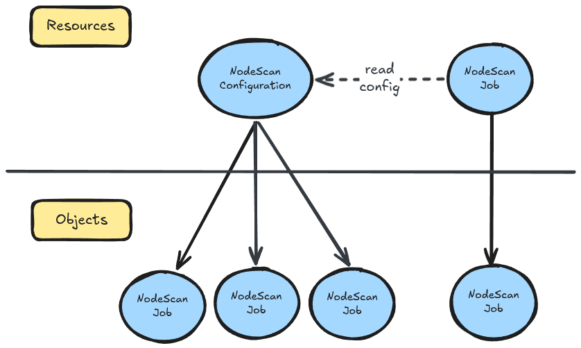
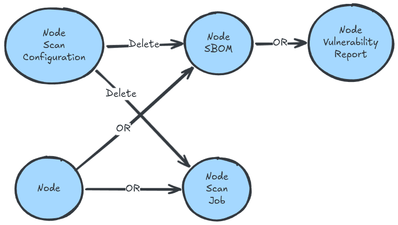

|              |                                 |
| :----------- | :------------------------------ |
| Feature Name | Node Scan                       |
| Start Date   | March 5th, 2026                 |
| Category     | Architecture                    |
| RFC PR       | [#922](https://github.com/kubewarden/sbomscanner/pull/922) |
| State        | **ACCEPTED**                    |

# Summary

[summary]: #summary

Define the architectural and functional requirements for scanning Kubernetes cluster nodes.

# Motivation

[motivation]: #motivation

We aim to develop a full-stack, SBOM-based security scanner for Kubernetes.
Because nodes are the foundation of the cluster, maintaining visibility into their 
security posture is critical.

This feature provides a comprehensive overview of node-level vulnerabilities, 
ensuring the safety of the infrastructure where workloads reside.

## Examples / User Stories

[examples]: #examples

- As a user, I want to have a comprehensive overview of node-level vulnerabilities, ensuring the safety of the infrastructure where workloads reside.
- As a user, I want to automatically scan cluster nodes for vulnerabilities on a recurring basis.
- As a user, I want to define the scan interval for my nodes.
- As a user, I want the ability to exclude specific files or directories from the scan to reduce noise or avoid sensitive paths.

# Detailed design

[design]: #detailed-design

Node scanning is implemented by deploying a `DaemonSet` that executes a worker 
component on every node.

The worker will be provided with these new flags:
* `--mode` to operate between `registry` and `node` scanning
* `--node-name` to specify the name of the node to be scanned (only used in `node` scanning mode)

This approach will allow for significant code reuse across different scan targets.
When `--mode=node` is set, the `--node-name` flag must be provided, 
and the worker will subscribe to the NATS subjects `sbomscanner.nodesbom.generate.{node-name}` 
and `sbomscanner.nodesbom.scan.{node-name}` to receive scan jobs specific to that node.
It will sit idle most of the time and perform the job only when requested to do it.

This feature also allows nodes to be excluded from the scan (eg. if they don't have enough resources).
This can be achieved with the `nodeSelector`, where only nodes matching the selector 
are considered for scanning. If not specified, all the nodes are going to be scanned.

The `NodeScanConfiguration` is primarily used to schedule periodic scans over time
through the `scanInterval` attribute.

To trigger an immediate scan outside the regular interval, the user can annotate
the `NodeScanConfiguration` resource with `sbomscanner.kubewarden.io/node-rescan-requested: "true"`.
This will trigger a new scan immediately, and the annotation will be automatically
removed after the scan is completed.

Please, note that `NodeScanConfiguration` is a singleton resource, 
meaning that there can be only one instance of it in the cluster.

## CRDs

For this feature we are going to add the following CRDs:

* `NodeScanConfiguration`: Defines the global scan settings.
  * `scanInterval`: Duration between automated scans.
  * `nodeSelector`: Filter which nodes are scanned.
    If not specified, all the nodes are scanned.
  * `skipPatterns`: A list of file/directory paths to be ignored.
    This can be expressed as .gitignore-like patterns (eg. `**/tmp/**` to ignore all the `tmp` directories).
    If not specified, no file is ignored.
    Here's an example of how to use the `skipPatterns` field:
    ```yaml
    # Gitignore-style patterns to exclude from filesystem scans.
    # Trailing "/" = directory, otherwise = file.
    skipPatterns:
      - "node_modules/"       # → --skip-dirs node_modules
      - "**/vendor/"          # → --skip-dirs (glob expanded at scan time)
      - ".git/"               # → --skip-dirs .git
      - "*.min.js"            # → --skip-files *.min.js
      - "package-lock.json"   # → --skip-files package-lock.json
    ```
  * `platforms`: A list of platforms (OS + architecture) to be scanned. If not specified, all platforms are scanned.

```yaml
apiVersion: sbomscanner.kubewarden.io/v1alpha1
kind: NodeScanConfiguration
metadata:
  name: default
spec:
  skipPatterns:
    - "/tmp/"
    - ".git/"
    - "package-lock.json"
  scanInterval: 2m
  nodeSelector:
    matchExpressions:
      - key: kubernetes.io/hostname
        operator: In
        values:
          - k3d-second-node-0
  platforms:
    - linux/amd64
    - linux/arm64
```

* `NodeScanJob`: Represents a single execution of a node scan.
  * `nodeName`: The name of the node to be scanned.

```yaml
apiVersion: sbomscanner.kubewarden.io/v1alpha1
kind: NodeScanJob
metadata:
  name: node-scan-1
spec:
  nodeName: k3d-second-node-0
```

* `NodeSBOM`: Stores the Software Bill of Materials for a specific node.
  This resource is stored in the Storage API Extension Server and is very similar to their counterpart `SBOM`.

* `NodeVulnerabilityReport`: Contains the results of the vulnerability analysis.
  This resource is stored in the Storage API Extension Server and is very similar to their counterpart `VulnerabilityReport`.

Here's the overview of the resources landscape:



### NodeMetadata Struct

`NodeSBOM` and `NodeVulnerabilityReport` are equal to the [`SBOM`](https://github.com/kubewarden/sbomscanner/blob/main/api/storage/v1alpha1/sbom_types.go) and 
[`VulnerabilityReport`](https://github.com/kubewarden/sbomscanner/blob/main/api/storage/v1alpha1/vulnerabilityreport_types.go) resource, execept for except for [`ImageMetadata`](https://github.com/kubewarden/sbomscanner/blob/main/api/storage/v1alpha1/image_metadata.go).
In this case, we are going to use the `NodeMetadata` structure to store 
information about the node.

`NodeMetadata` will have the following attributes:

* `Name` specifies the unique name of the node in the cluster.
* `Platform` specifies the OS + CPU architecture of the node. Example: linux/amd64, linux/arm64.

## Scan Workflow

1. The user applies a `NodeScanConfiguration` with a defined `scanInterval`. Optionally, the user can annotate the resource with `sbomscanner.kubewarden.io/node-rescan-requested: "true"` to trigger an immediate scan that will be automatically removed after the scan.
2. The controller creates a `NodeScanJob` for each node matching the `nodeSelector` (or all nodes if no selector is specified).
3. Each worker subscribes to the NATS subjects `sbomscanner.nodesbom.generate.{node-name}` and `sbomscanner.nodesbom.scan.{node-name}`, and receives the scan job for its node.
4. The worker executes the scan, generating a `NodeSBOM` and a `NodeVulnerabilityReport` for the node.
5. The results are stored in the cluster and can be accessed by the user for review and remediation.

To let users easily understand the flow, here's a simple diagram:


Without the `NodeScanConfiguration`, users cannot apply a `NodeScanJob` independently,
since the `NodeScanConfiguration` holds the configuration used by all `NodeScanJob` resources
(e.g., `skipPatterns`, `nodeSelector`, `platforms`).

When a new `NodeScanJob` is about to be created, the runner checks whether another `NodeScanJob` is already in progress for the same node.
If another job is already active, the new job is not created.



## Reconcilers

The NodeScan reconciler is responsible for creating `NodeScanJob` resources based on the 
`NodeScanConfiguration` and ensuring that the scan jobs are executed according to the defined schedule.

The NodeScanJob reconciler is responsible for managing the lifecycle of `NodeScanJob` resources, 
including checking for concurrent scans, updating status conditions, and triggering the scan on 
the node by publishing a message to the NATS subject `sbomscanner.nodesbom.generate.{node-name}`.

The NodeScan runner (as a [runnable](https://github.com/kubernetes-sigs/controller-runtime/blob/fdc6658a141b99a3fcb733c8a8000f98e6666f48/pkg/manager/manager.go#L269-L277)) is responsible for executing the scan on the node automatically,
based on the `scanInterval` defined in the `NodeScanConfiguration`, and for processing the results 
to create `NodeSBOM` and `NodeVulnerabilityReport` resources.

## Status Conditions

NodeScanJobs will have status conditions to provide visibility into the scan process.

The `NodeScanJob` has status conditions very similar to [`ScanJob`](https://github.com/kubewarden/sbomscanner/blob/main/api/v1alpha1/scanjob_types.go#L36):

Status: `Scheduled` (The job is created but hasn't started doing actual work)
* `Scheduled`: The system has accepted the request and scheduled it.
* `Pending`: The job is in the queue waiting for resources or an executor to pick it up.

Status: `InProgress` (The job is actively executing)
* `InProgress`: Currently scanning the node's filesystem and collecting data.
* `SBOMGenerationInProgress`: Currently running vulnerability analysis on the generated SBOM.

Status: `Complete` (The job finished successfully)
* `Complete`: Generic success indicator.

Status: `Failed` (The job encountered a terminal error)
* `Failed`: Generic failure indicator (e.g., bad user input, invalid target).
* `NodeScanConfigurationMissing`: Failed because the `NodeScanConfiguration` resource was not found.
* `NodeNotMatching`: Failed because the node does not match the `NodeScanConfiguration` node selector or platform filter.

As for the `WorkloadScan` status conditions, the mechanism works the same.
When `Scheduled` is `true`, then all the other conditions are `false` and their reason is `Scheduled`. 
When `Pending` is `true`, then all the other conditions are `false` and their reason is `Pending`.
When `InProgress` is `true`, then all the other conditions are `false` and their reason is `InProgress`.
When `Complete` is `true`, then all the other conditions are also `false` and their reason is `Complete`.

## NodeScanJob retention

A maximum of X `NodeScanJob` resources per node will be retained in the system for auditing and historical purposes, with X being a configurable value.
This logic is implemented within the `NodeScanJob` reconciler.

## Garbage Collection

There are two different ways we need to take into account for garbage collection: Kubernetes garbage collection and client-side cleanup.

### Kubernetes garbage collection (NodeScanConfiguration deletion)

The owner reference chain is: `NodeScanConfiguration` → `NodeScanJob`, and `NodeScanConfiguration` → `NodeSBOM` → `NodeVulnerabilityReport`.
When the `NodeScanConfiguration` is deleted, Kubernetes garbage collection cascades through the owner references and cleans up all `NodeScanJob`, `NodeSBOM`, and `NodeVulnerabilityReport` automatically.

### Client cleanup (Node deletion)

When a `Node` is deleted, the controller must actively clean up the `NodeScanJob` and `NodeSBOM` associated with that node using the client.
`NodeVulnerabilityReport` are cascade-deleted for free since they are owned by their respective `NodeSBOM`.

Garbage collection is crucial to prevent resource orphaning and to maintain a clean cluster state. 

| When Deleting             | Also Delete                |
|---------------------------|----------------------------|
| `Node`                    | `NodeScanJob`, `NodeSBOM`, `NodeVulnerabilityReport` |
| `NodeScanConfiguration`   | `NodeScanJob`, `NodeSBOM`, `NodeVulnerabilityReport` |
| `NodeScanJob`             | nothing |
| `NodeSBOM`                | `NodeVulnerabilityReport` |
| `NodeVulnerabilityReport` | nothing |



# Drawbacks

[drawbacks]: #drawbacks

Mounting the host filesystem into a container bridges the isolation boundary and 
introduces significant risk. To mitigate potential host compromise, the `DaemonSet` 
must mount the host root filesystem as `readOnly: true`.
